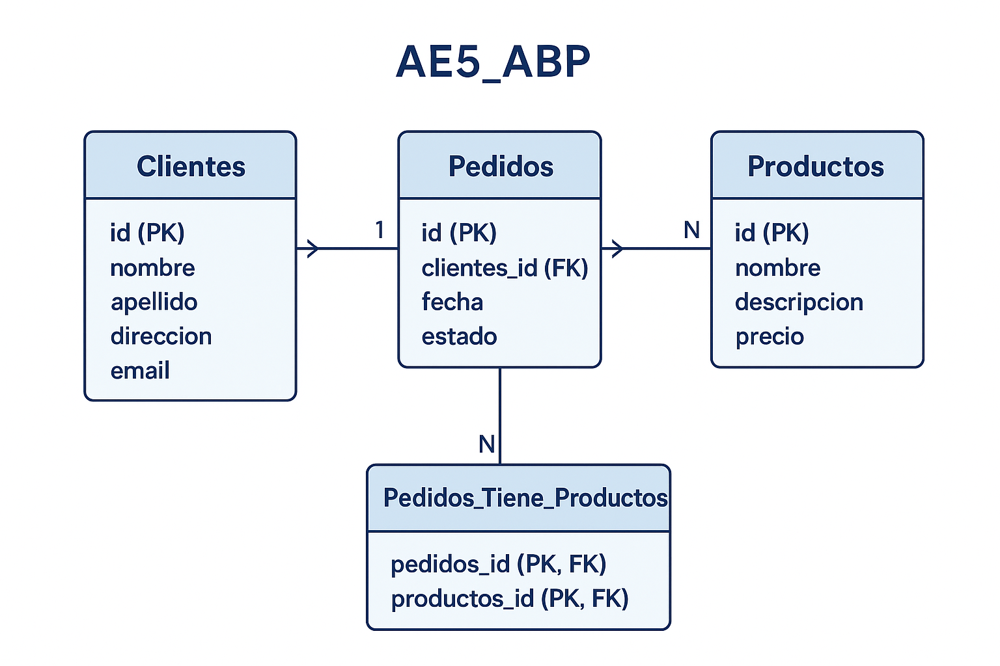

## Descripción
Proyecto de gestión de pedidos y clientes utilizando **MySQL**.  
Permite crear, consultar, actualizar y eliminar información de clientes, productos y pedidos, aplicando conceptos de bases de datos relacionales.  
El proyecto demuestra el uso de **DDL, DML y consultas SQL**, así como la correcta modelación de datos mediante un **diagrama ER**.

## Diagrama ER

El diagrama muestra las cuatro tablas principales y sus relaciones:  
- `Clientes (1) -> Pedidos (N)`  
- `Pedidos (N) <-> Productos (N)` a través de `Pedidos_Tiene_Productos`  

Cada tabla incluye sus **claves primarias (PK)** y **foráneas (FK)**.

---

## Estructura del repositorio
AE5_ABP/
├─ diagramas/ -> Diagrama ER
│ └─ ER_ae5_abp.png
├─ sql/
│ ├─ ddl/ -> Creación de tablas
│ │ └─ crear_tablas.sql
│ ├─ dml/ -> Inserción, actualización y eliminación de datos
│ │ └─ manipulacion_datos.sql
│ └─ consultas/ -> Consultas SQL
│ └─ consultas_ejemplo.sql
└─ README.md

